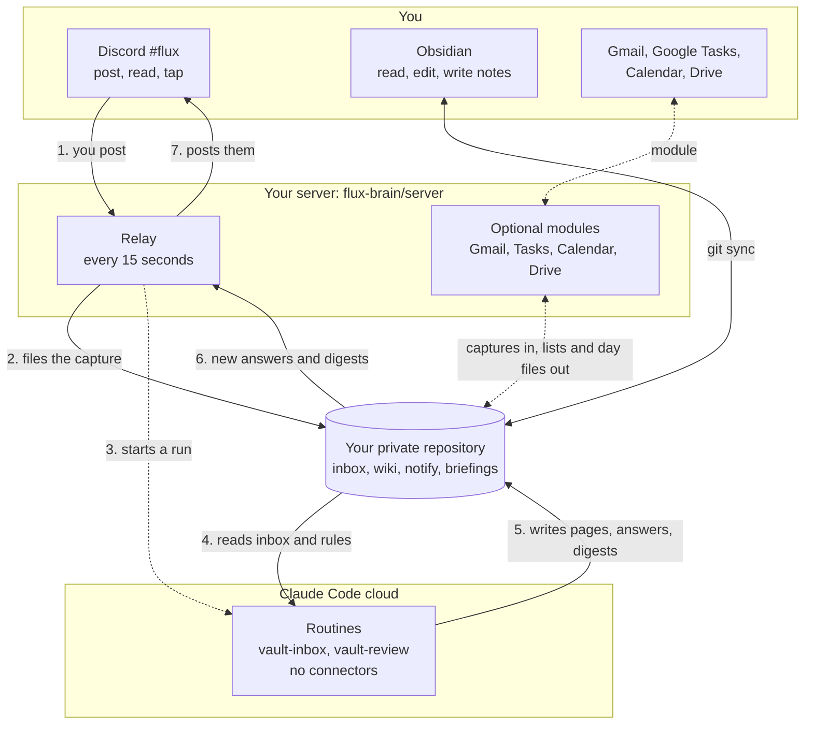
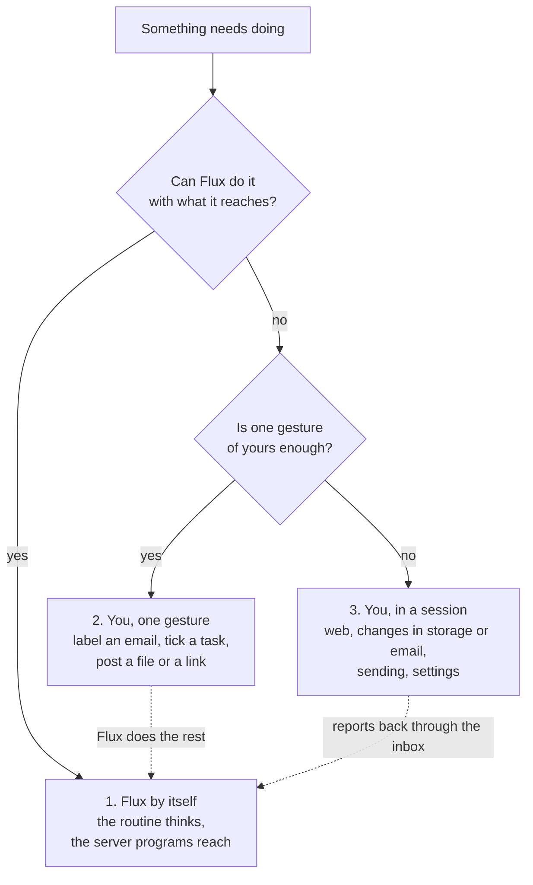

# Flux vault template

The memory half of **Flux**, a personal AI assistant built on a second-brain structure: an Obsidian
vault that Claude maintains for you using the LLM Wiki pattern. You capture; Claude files, links,
summarises, drafts, reviews and asks you questions. You read the result in Obsidian on your phone or
laptop and talk to it through a Discord channel.

This repository is a **template**: press "Use this template" on GitHub to get your own private copy.
It contains the rules Claude follows (`CLAUDE.md`), the folder layout, the page template and the
instructions for the daily digest and the weekly review. It contains no content.

## Architecture

Three parts, joined only by the repository:

- **The routines think.** They run in Anthropic's cloud on a fresh copy of the repository, read
  `CLAUDE.md` and the inbox, and write pages, answers and digests. They have no web access and no
  connector, so nothing they read (an email, a document) can make them act outside the repository.
- **The server reaches.** The relay and the optional modules are small programs with fixed rules and no
  language model: they move things between Discord, Google and the repository, convert attachments to
  text and start the routine.
- **The repository is the meeting point** and the source of truth. Obsidian is only a reader and editor
  of a synced copy; nothing depends on it running.

The numbers follow one capture: you post, the relay files it and starts a run, the routine reads and
writes, and the relay posts the result back, usually within two to three minutes. Dashed arrows are
optional modules.

## What you need

1. A private GitHub repository made from this template.
2. A Claude Code subscription that includes cloud routines (scheduled runs that can be started on
   demand through an API trigger). The routines do the filing; see "Routines" below.
3. A small always-on machine (a home server, a VPS) for the relay that connects Discord to the
   repository. The relay lives in the companion repository
   [flux-brain/server](https://github.com/flux-brain/server); without it you can still use the
   vault by writing notes straight into `inbox/` from Obsidian and letting the hourly routine file them.
4. Obsidian on your devices. On Android, GitSync keeps the phone copy in step; on a laptop, git or the
   Obsidian Git plugin.

## Set up

1. Create the repository from the template, private.
2. Edit `flux.md`: your name, time zone, languages, channel names, which optional modules are on.
   Delete the `ops/` files of modules you do not use.
3. Create the two routines (below) and note the trigger token of the inbox one for the relay.
4. Install the relay on your server ([flux-brain/server](https://github.com/flux-brain/server),
   `INSTALL.md`) with your Discord bot, channel names and the trigger token.
5. Open the repository in Obsidian. Post something in `#flux`. Within a few minutes it is filed under
   `wiki/` and Claude tells you what it did.

## Routines

Two routines, both with this repository as their working copy and `CLAUDE.md` as their instructions:

| Routine | Schedule (UTC) | Prompt |
|---|---|---|
| `vault-inbox` | hourly during your day, e.g. `0 6-20 * * *`, plus on-demand starts by the relay | [routines/vault-inbox.md](routines/vault-inbox.md) |
| `vault-review` | once a day, e.g. `0 5 * * *` | [routines/vault-review.md](routines/vault-review.md) |

The `routines/` folder holds the exact prompts and settings (tools Bash, Read, Write, Edit, Glob and
Grep, no connectors) with four placeholders to fill. Generate an API trigger token for `vault-inbox`; the
relay uses it to start a run the moment a capture arrives and posts the run link to `#flux-log` so you
can watch Claude work.

## How it works, in short

- **Capture:** post text, links, photos, PDFs, voice memos in `#flux`. The relay files each message
  into `inbox/` within about 15 seconds and reacts to confirm. Or write a note straight into `inbox/`
  from Obsidian.
- **Attachments:** the original goes to your cloud storage folder; its text (PDF text or OCR, images,
  Office files, emails, transcribed audio) goes to `raw/attachments/` so Claude can read it.
- **Processing:** the relay starts the `vault-inbox` routine right away, so results usually come back
  in two to three minutes; the hourly run is the backstop.
- **Answers and drafts** arrive in `notify/` and are posted to `#flux`, ready to copy. **Questions**
  from Claude @mention you. Answer by replying in the channel; the answer comes back through the inbox.
- **Reviews:** a daily digest and, on Sundays, a weekly project review, posted to `#flux`.
- **Optional modules**, each off until you turn it on: a Google Tasks list for every active project
  page, a Gmail label feed, your calendar as one file per day, a watch on chosen Drive folders, a list
  of your sent emails still waiting for an answer, and email triage with buttons in `#flux`. The
  current list and what each needs is the Modules table in
  [flux-brain/server](https://github.com/flux-brain/server#modules).

## Who does the work

Not everything you ask for can be done by the routine: it cannot browse the web, change a file in your
cloud storage or send an email, on purpose. So every piece of work goes down one of three lanes, and
Claude always takes the first one that fits (the rule is in `CLAUDE.md`, "Who does the work").

| Lane | Who acts | Examples | How it shows up |
|---|---|---|---|
| 1. Flux by itself | The routine and the server programs | File a capture, link pages, tick or date an action, write a requested text in full, the daily digest | Done within minutes; the result is posted in `#flux` |
| 2. You, one gesture | You, from your phone | Give an email the filing label, tick a task, post a file or a document link in `#flux` | A plain next action that names the gesture |
| 3. You, in a session | You, with an interactive Claude Code session | Web research, saving or changing a file in cloud storage, a real draft in your mailbox, sending anything | A next action tagged `#session`, gathered in `session.md` |

Why three: the routine can think but can touch nothing outside the repository, and the server programs
can reach your accounts but only follow fixed rules. Only an interactive session has both, and it acts
only when you ask. Which gestures exist in lane 2 depends on the modules you turned on.

Lane 3 has its own queue: `session.md`, at the top of the repository, lists every open `#session`
action with a link to its page, and the daily digest shows them under "Needs a session". Open a Claude
Code session, ask it to work that list, and it reports back with a note in `inbox/` that the next run
files like any capture.

## Privacy by design

Flux never reads your private conversations with other people (messaging apps). Nothing from them
enters this repository, and the routines have no way to reach them. See `CLAUDE.md`, "Privacy of
private conversations".

## Licence

Apache License 2.0; see `LICENSE` and `NOTICE`.
